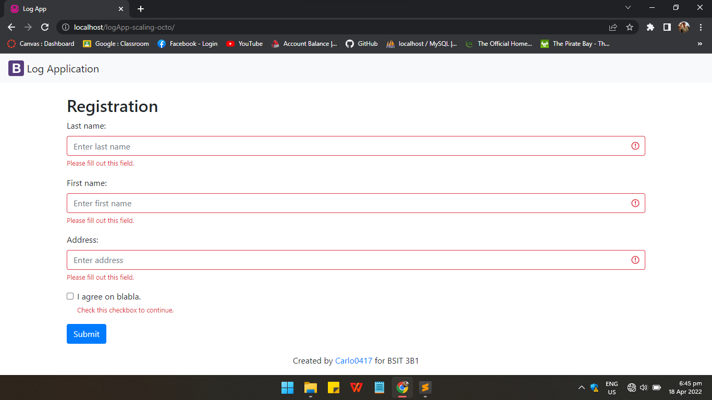
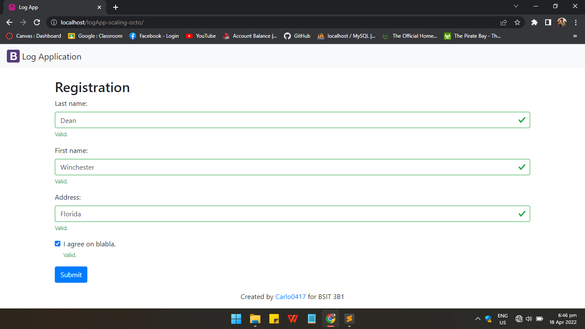
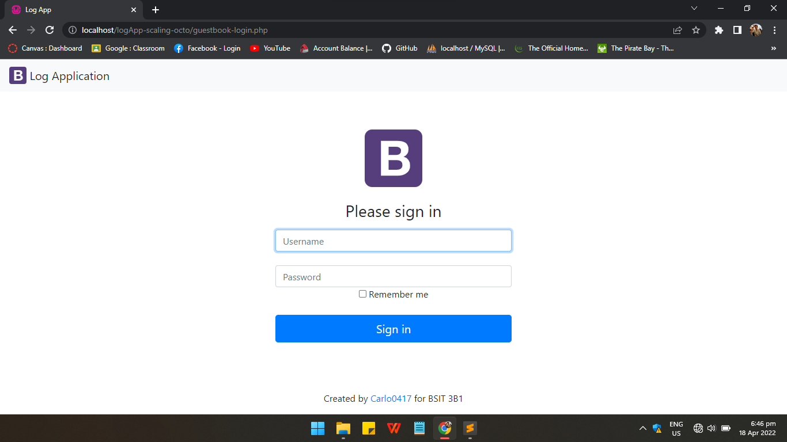
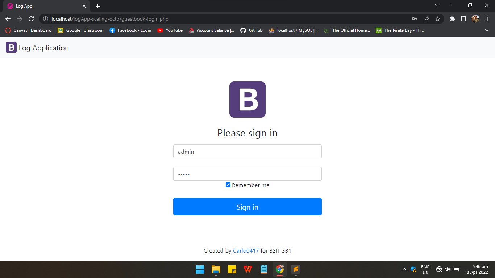
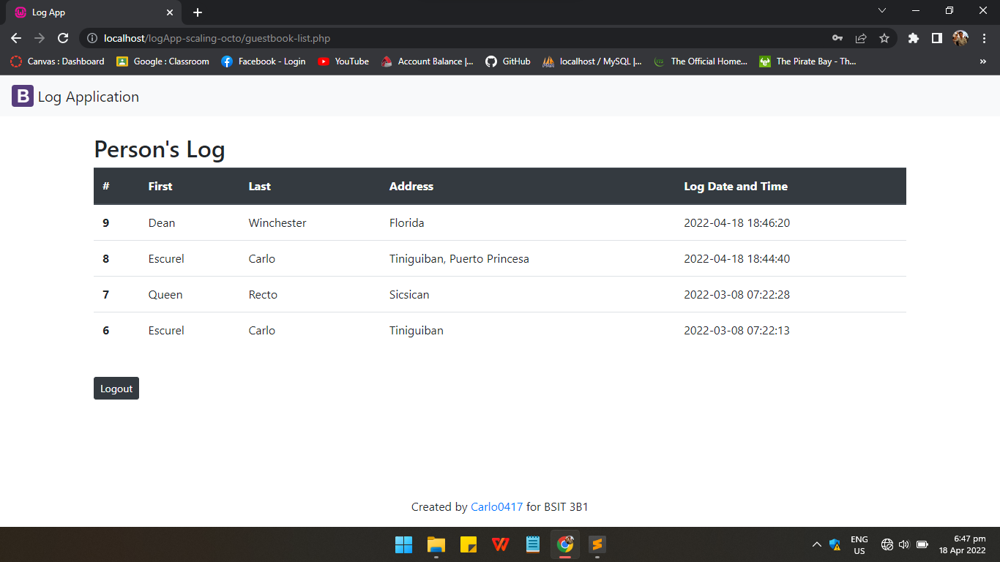

##### :space_invader: This repo is from Practice Set 5-06

# logApp-Escurel

logApp-Escurel or **logApp** is a simple application that logs the individual's personal information and the date and time he/she visits the place via its **Registration Page**. It also has a **Login Page** for the administrator to enter the **Main Page** and view the information acquired from the registration through table, as well as a **Logout** button to exit the Main Page.

<br />

## Visuals

### **Registration without content**



<br />

### **Registration with content**



<br />

### **Admin Login Page**



<br />

### **Admin Login Page with content**



<br />

### **Table of Data from Registration**



<br /> <br />

# Deploying Web Application in Heroku
Heroku is a container-based cloud Platform as a Service (PaaS). Developers use Heroku to deploy, manage,
and scale modern apps. Our platform is elegant, flexible, and easy to use, offering developers the simplest
path to getting their apps to market. (www.heroku.com, 2021)

Free sql database is a web based service to provide sql database functionality for free. (www.freesqldataba
se.com, 2021)

<br />

## Setting up your database in a free web server
* Create an account at https://www.freesqldatabase.com
* Log in to your account, create a database and take note your database details.
* Click the "Follow this link for phpMy Admin"
* Setup your database:  
    * Create tables - PERSON(pid, lastname, firstname, address, logdt) and USERACCOUNT(uid,username, password)  
    * Make sure to set logDT data type to TIMESTAMP and default value to CURRENT_TIMESTAMP  
    * Add atleast one (1) row in USERACCOUNT table so you can test the Log In page.

<br />

## Editing logApp Source Code
* Open the file config.php, and modify the value set for DB_HOST, DB_USER, DB_PASS, DB_NAME
according to your Database details in freesqldatabase account.
* Test if the system functions as expected.
*  If yes, PUSH the content to logApp-YourLastname repository. Otherwise, fix that problem.

<br />

## Installing Composer
* To install Composer go to this link https://getcomposer.org/download/ and follow the steps provided there.

<br />

## Installing Heroku
* Download Heroku
    * for 32 bit: https://cli-assets.heroku.com/heroku-x86.exe 
    * for 64 bit: https://cli-assets.heroku.com/heroku-x64.exe  
* Once installed, you can use the heroku command from your terminal. Try to login using heroku CLI, type the code below and press Enter.

```
$ heroku login
```

<br />

## Deploying the logApp
* Create an app on Heroku, using create command.
```
$ heroku create
```
(Heroku generates a random name (in this case glacial-savannah-88734) for my app.)

* Deploy your code.
```
$ git push heroku main
```
* Ensure that at least one instance of the app is running.
```
$ heroku ps:scale web=1
```

* Now visit the app at the URL generated by its app name.
```
$  heroku open
```
<br />

## Appling Changes
* Every time you change something in your application. To update your website, just push the modified files
to the repository.
```
$ git add .
$ git commit -m "changes made"
$ git push heroku main
```
<br /> <br />

## Author

### **Carlo Escurel**


